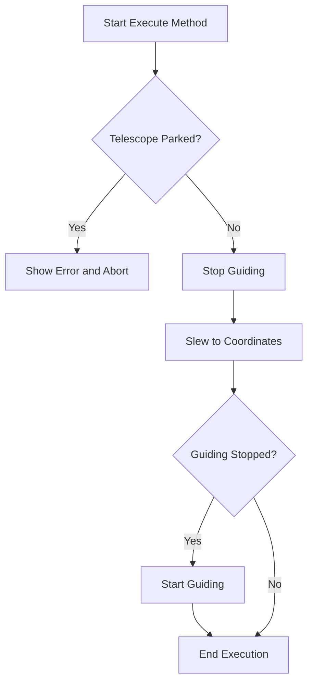

# SlewScopeToRaDec

The `SlewScopeToRaDec` class is responsible for moving the telescope to a specified right ascension (RA) and declination (Dec) coordinate. It handles the slewing operation and interacts with both the telescope and guiding systems, and supports context-based coordinate retrieval from its parent container.

## Class Overview

### Namespace

- **Namespace:** `NINA.Sequencer.SequenceItem.Telescope`
- **Dependencies:**
  - `NINA.Core.Model`
  - `NINA.Sequencer.Container`
  - `NINA.Sequencer.Validations`
  - `NINA.Astrometry`
  - `NINA.Equipment.Interfaces.Mediator`
  - `NINA.Core.Locale`
  - `NINA.Core.Utility.Notification`

### Class Declaration

```csharp
[ExportMetadata("Name", "Lbl_SequenceItem_Telescope_SlewScopeToRaDec_Name")]
[ExportMetadata("Description", "Lbl_SequenceItem_Telescope_SlewScopeToRaDec_Description")]
[ExportMetadata("Icon", "SlewToRaDecSVG")]
[ExportMetadata("Category", "Lbl_SequenceCategory_Telescope")]
[Export(typeof(ISequenceItem))]
[JsonObject(MemberSerialization.OptIn)]
public class SlewScopeToRaDec : SequenceItem, IValidatable
```

### Class Properties

- **telescopeMediator**: Interface for communicating with the telescope hardware.
- **guiderMediator**: Interface for managing the guiding system.
- **inherited**: Indicates if coordinates are inherited from the parent context.
- **Coordinates**: The target right ascension and declination coordinates.
- **issues**: List of validation issues.

### Constructor

The constructor initializes the `SlewScopeToRaDec` class with the provided telescope and guider mediators. It also initializes the `Coordinates` property.

```csharp
[ImportingConstructor]
public SlewScopeToRaDec(ITelescopeMediator telescopeMediator, IGuiderMediator guiderMediator)
```

### Key Methods

- **Clone()**: Creates a copy of the `SlewScopeToRaDec` instance with the same coordinates and configuration.
- **Execute(IProgress<ApplicationStatus> progress, CancellationToken token)**: Moves the telescope to the specified RA and Dec coordinates, handling any necessary guiding operations.
- **AfterParentChanged()**: Updates the coordinates if inherited from the parent context and revalidates the state.
- **RetrieveContextCoordinates(ISequenceContainer parent)**: Recursively retrieves coordinates from the parent container if available.
- **Validate()**: Checks if the telescope is connected and ready.
- **ToString()**: Provides a string representation of the class instance.

### Flowchart: Execution Process

Below is a flowchart illustrating the key steps in the `Execute` method of the `SlewScopeToRaDec` class.



### Flowchart Explanation

1. **Telescope Parked?**: Checks if the telescope is parked. If it is, an error message is shown, and the operation is aborted.
2. **Stop Guiding**: Stops the guiding process to prepare for the slewing operation.
3. **Slew to Coordinates**: Uses `telescopeMediator.SlewToCoordinatesAsync()` to move the telescope to the target RA and Dec coordinates.
4. **Guiding Stopped?**: Checks if guiding was stopped. If it was, guiding is restarted to resume normal operations.

### Detailed Method Descriptions

#### `Clone`

Creates a new instance of the `SlewScopeToRaDec` class with the same coordinates and configuration as the current instance.

#### `Execute`

1. **Check Telescope Status**: If the telescope is parked, an error is shown, and the method throws an exception.
2. **Stop Guiding**: Stops the guiding process to avoid conflicts during the slewing operation.
3. **Slew to Coordinates**: Uses `telescopeMediator.SlewToCoordinatesAsync()` to move the telescope to the specified RA and Dec coordinates.
4. **Restart Guiding**: If guiding was stopped, it restarts guiding to ensure normal operations continue.

#### `AfterParentChanged`

Updates the `Coordinates` property if the coordinates are inherited from the parent container. It also sets the `Inherited` flag and revalidates the instance.

#### `RetrieveContextCoordinates`

Recursively searches for the coordinates in the parent container, allowing for context-based retrieval of coordinates if the current instance does not have them.

#### `Validate`

Checks if the telescope is connected. If it is not, an error is added to the issues list.

#### `ToString`

Provides a string representation of the `SlewScopeToRaDec` instance, including the category, item name, and target coordinates.

### Coordinates

- **Coordinates**: Represents the right ascension and declination coordinates to which the telescope should move.
