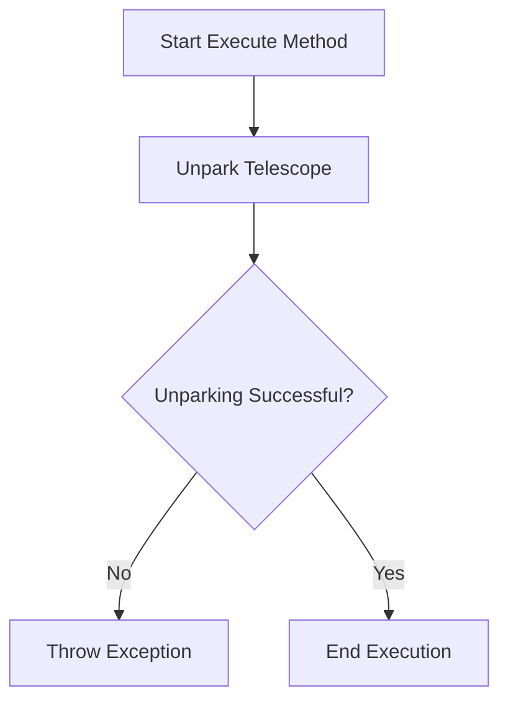

# UnparkScope

The `UnparkScope` class is designed to handle the process of unparking the telescope. This class interacts with the telescope system to bring the telescope out of the parked state and is used in sequence operations within the N.I.N.A. (Nighttime Imaging 'N' Astronomy) application.

## Class Overview

### Namespace

- **Namespace:** `NINA.Sequencer.SequenceItem.Telescope`
- **Dependencies:**
  - `NINA.Core.Model`
  - `NINA.Sequencer.Validations`
  - `NINA.Equipment.Interfaces.Mediator`
  - `NINA.Core.Locale`

### Class Declaration

```csharp
[ExportMetadata("Name", "Lbl_SequenceItem_Telescope_UnparkScope_Name")]
[ExportMetadata("Description", "Lbl_SequenceItem_Telescope_UnparkScope_Description")]
[ExportMetadata("Icon", "UnparkSVG")]
[ExportMetadata("Category", "Lbl_SequenceCategory_Telescope")]
[Export(typeof(ISequenceItem))]
[JsonObject(MemberSerialization.OptIn)]
public class UnparkScope : SequenceItem, IValidatable
```

### Class Properties

- **telescopeMediator**: Interface for communicating with the telescope hardware.
- **issues**: List of validation issues encountered.

### Constructor

The constructor initializes the `UnparkScope` class with the provided `telescopeMediator`.

```csharp
[ImportingConstructor]
public UnparkScope(ITelescopeMediator telescopeMediator)
```

### Key Methods

- **Clone()**: Creates a copy of the `UnparkScope` instance.
- **Execute(IProgress<ApplicationStatus> progress, CancellationToken token)**: Unparks the telescope using `telescopeMediator`.
- **Validate()**: Checks if the telescope is connected and sets any validation issues.
- **AfterParentChanged()**: Revalidates the state when the parent changes.
- **ToString()**: Provides a string representation of the `UnparkScope` instance.

### Flowchart: Execution Process

Below is a flowchart illustrating the key steps in the `Execute` method of the `UnparkScope` class.



### Flowchart Explanation

1. **Unpark Telescope**: Calls `telescopeMediator.UnparkTelescope()` to unpark the telescope.
2. **Unparking Successful?**: Checks if the unparking was successful. If not, an exception is thrown.
3. **End Execution**: If successful, the method completes without errors.

### Detailed Method Descriptions

#### `Clone`

Creates a new instance of the `UnparkScope` class with the same configuration as the current instance.

#### `Execute`

1. **Unpark Telescope**: Uses `telescopeMediator.UnparkTelescope()` to unpark the telescope.
2. **Check Success**: If the unparking operation fails, an exception (`SequenceEntityFailedException`) is thrown.

#### `Validate`

Checks if the telescope is connected by querying `telescopeMediator.GetInfo()`. If not connected, adds an error message to the issues list.

#### `AfterParentChanged`

Revalidates the `UnparkScope` instance when its parent changes, ensuring that the state is still valid.

#### `ToString`

Provides a string representation of the `UnparkScope` instance, including the category and item name.
