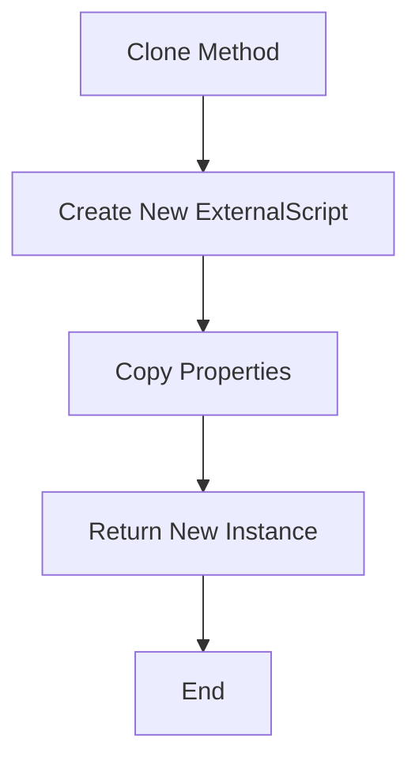
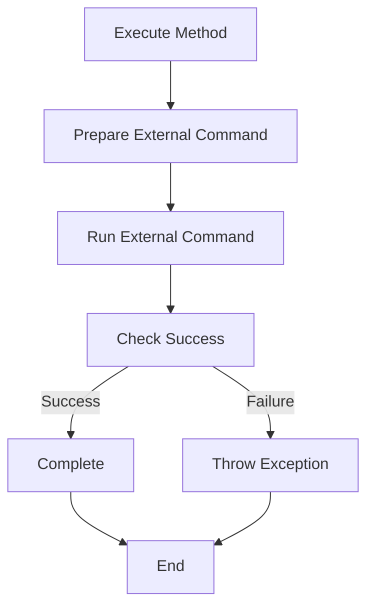
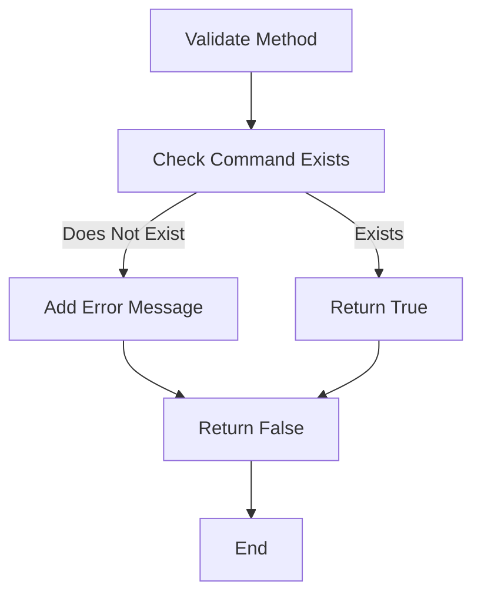
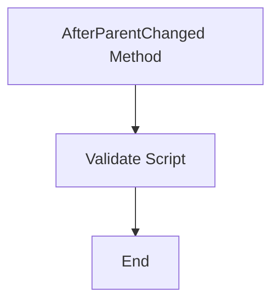
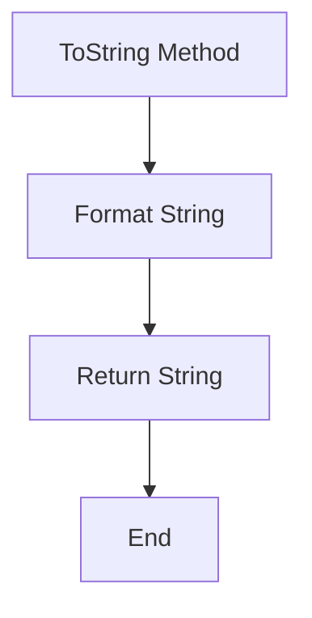

# ExternalScrip

The `ExternalScript` class is part of the `NINA.Sequencer.SequenceItem.Utility` namespace and is designed to execute an external script or command as part of a sequence item.

## Namespace

```csharp
namespace NINA.Sequencer.SequenceItem.Utility
```

## Class Declaration

```csharp
[ExportMetadata("Name", "Lbl_SequenceItem_Utility_ExternalScript_Name")]
[ExportMetadata("Description", "Lbl_SequenceItem_Utility_ExternalScript_Description")]
[ExportMetadata("Icon", "ScriptSVG")]
[ExportMetadata("Category", "Lbl_SequenceCategory_Utility")]
[Export(typeof(ISequenceItem))]
[JsonObject(MemberSerialization.OptIn)]
public class ExternalScript : SequenceItem, IValidatable
```

## Properties

### `OpenDialogCommand`

- **Type:** `System.Windows.Input.ICommand`
- **Description:** Command to open a file dialog for selecting the script to execute.

### `Issues`

- **Type:** `IList<string>`
- **Description:** List of validation issues.
- **Json Property:** `[JsonProperty]`

### `Script`

- **Type:** `string`
- **Description:** Path to the external script or command to be executed.
- **Json Property:** `[JsonProperty]`

## Constructors

### Default Constructor

```csharp
public ExternalScript()
```

- **Description:** Initializes the command to open a file dialog for selecting the script.

### Clone Constructor

```csharp
private ExternalScript(ExternalScript cloneMe) : this()
```

- **Parameters:**
  - `cloneMe`: The instance to clone.

## Methods

### `Clone`

```csharp
public override object Clone()
```

- **Description:** Creates a deep copy of the current `ExternalScript` instance.
- **Flowchart:**



### `Execute`

```csharp
public override async Task Execute(IProgress<ApplicationStatus> progress, CancellationToken token)
```

- **Description:** Executes the external script or command and reports progress.
- **Flowchart:**



### `Validate`

```csharp
public bool Validate()
```

- **Description:** Validates if the script or command exists and is executable.
- **Flowchart:**



### `AfterParentChanged`

```csharp
public override void AfterParentChanged()
```

- **Description:** Validates the script after a parent change event.
- **Flowchart:**



### `ToString`

```csharp
public override string ToString()
```

- **Description:** Returns a string representation of the `ExternalScript` instance.
- **Flowchart:**


