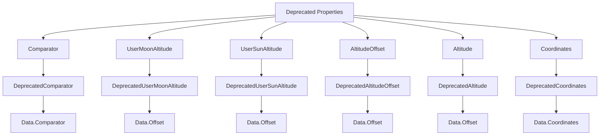

# WaitForAltitudeBase

The `WaitForAltitudeBase` class is an abstract class used in the N.I.N.A. (Nighttime Imaging 'N' Astronomy) application to handle operations related to waiting for a celestial body to reach a specified altitude. It includes properties and methods to manage altitude conditions and backward compatibility for deprecated fields.

## Namespace

```csharp
namespace NINA.Sequencer.SequenceItem.Utility
```

## Class Declaration

```csharp
public abstract class WaitForAltitudeBase : SequenceItem
```

## Properties

### `ProfileService`

- **Type:** `IProfileService`
- **Description:** Provides access to profile data used in altitude calculations and waiting processes.

### `Data`

- **Type:** `WaitLoopData`
- **Description:** Contains configuration and data for the waiting loop, including altitude settings and comparison operators.

### `Issues`

- **Type:** `IList<string>`
- **Description:** A list of issues encountered during the waiting process.

## Constructor

```csharp
public WaitForAltitudeBase(IProfileService profileService, bool useCustomHorizon)
```

- **Parameters:**
  - `profileService`: Service for accessing profile data.
  - `useCustomHorizon`: Boolean indicating whether to use custom horizon data.

Initializes the `ProfileService` and `Data` properties.

## Methods

### `CalculateExpectedTime()`

- **Description:** Abstract method that must be implemented by derived classes to calculate the expected time for the altitude condition to be met.

## Obsolete Migration Properties

These properties are retained for backward compatibility and are mapped to the `Data` property in the `WaitLoopData` class.

### Deprecated Properties Flowchart



### `Comparator`

- **Deprecated Name:** `DeprecatedComparator`
- **Type:** `ComparisonOperatorEnum`
- **Description:** Specifies the comparison operator for altitude conditions. The value is converted to the current enum format.

### `UserMoonAltitude`

- **Deprecated Name:** `DeprecatedUserMoonAltitude`
- **Type:** `double`
- **Description:** Altitude offset for the moon.

### `UserSunAltitude`

- **Deprecated Name:** `DeprecatedUserSunAltitude`
- **Type:** `double`
- **Description:** Altitude offset for the sun.

### `AltitudeOffset`

- **Deprecated Name:** `DeprecatedAltitudeOffset`
- **Type:** `double`
- **Description:** General altitude offset.

### `Altitude`

- **Deprecated Name:** `DeprecatedAltitude`
- **Type:** `double`
- **Description:** Specific altitude value.

### `Coordinates`

- **Deprecated Name:** `DeprecatedCoordinates`
- **Type:** `InputCoordinates`
- **Description:** Coordinates used for the altitude calculation.
