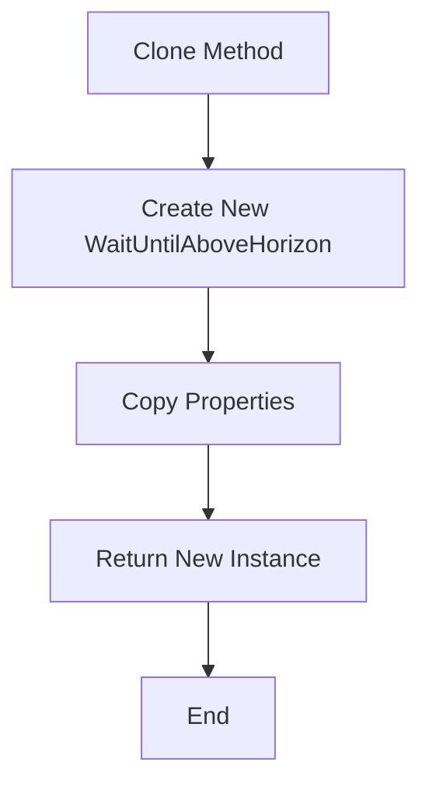
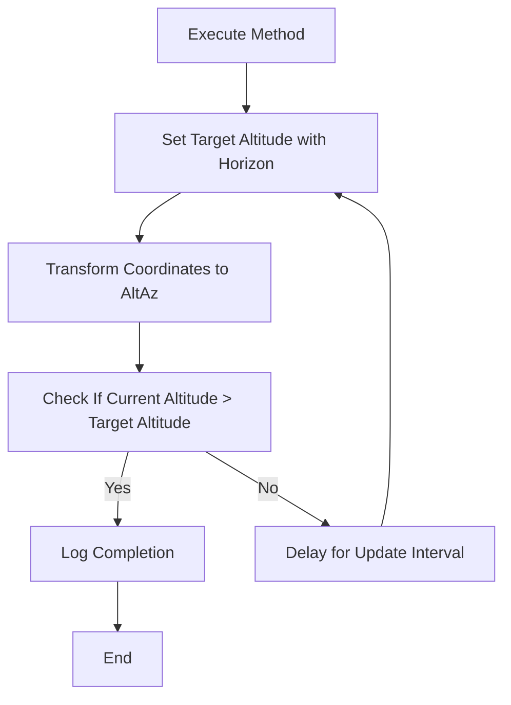
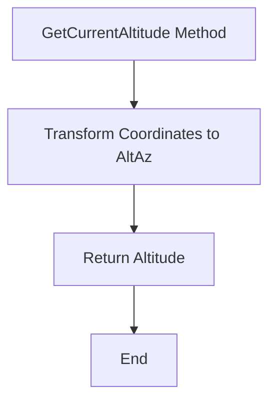
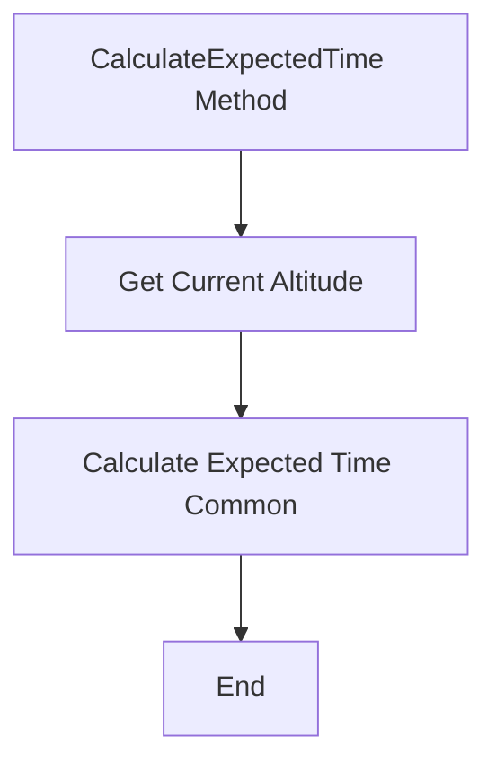
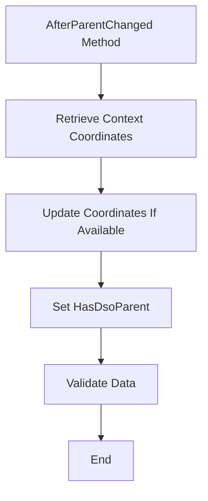
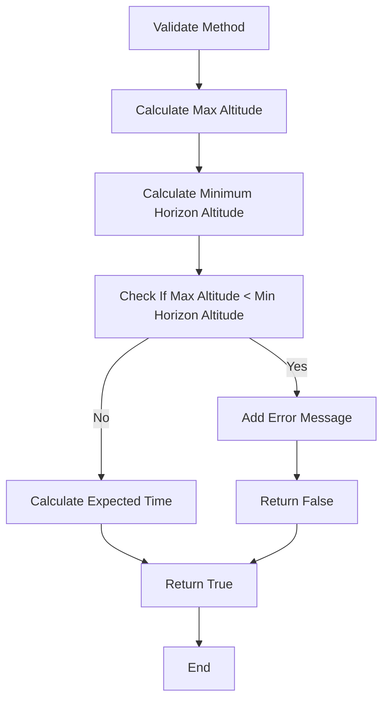

# WaitUntilAboveHorizon

The `WaitUntilAboveHorizon` class is part of the `NINA.Sequencer.SequenceItem.Utility` namespace and is used to wait until an astronomical object is above a specified horizon level.

## Namespace

```csharp
namespace NINA.Sequencer.SequenceItem.Utility
```

## Class Declaration

```csharp
[ExportMetadata("Name", "Lbl_SequenceItem_Utility_WaitUntilAboveHorizon_Name")]
[ExportMetadata("Description", "Lbl_SequenceItem_Utility_WaitUntilAboveHorizon_Description")]
[ExportMetadata("Icon", "WaitForAltitudeSVG")]
[ExportMetadata("Category", "Lbl_SequenceCategory_Utility")]
[Export(typeof(ISequenceItem))]
[JsonObject(MemberSerialization.OptIn)]
public class WaitUntilAboveHorizon : WaitForAltitudeBase, IValidatable
```

## Properties

### `HasDsoParent`

- **Type:** `bool`
- **Description:** Indicates if this item has a Deep-Sky Object (DSO) parent.
- **Json Property:** `[JsonProperty]`

### `UpdateInterval`

- **Type:** `int`
- **Description:** The interval, in seconds, for checking the altitude.
- **Default Value:** `1`

## Constructors

### Default Constructor

```csharp
[ImportingConstructor]
public WaitUntilAboveHorizon(IProfileService profileService) : base(profileService, useCustomHorizon: true)
```

- **Parameters:**
  - `profileService`: Service providing profile information.

### Clone Constructor

```csharp
private WaitUntilAboveHorizon(WaitUntilAboveHorizon cloneMe) : this(cloneMe.ProfileService)
```

- **Parameters:**
  - `cloneMe`: The instance to clone.

## Methods

### `Clone`

```csharp
public override object Clone()
```

- **Description:** Creates a deep copy of the current `WaitUntilAboveHorizon` instance.
- **Flowchart:**



### `Execute`

```csharp
public override async Task Execute(IProgress<ApplicationStatus> progress, CancellationToken token)
```

- **Description:** Continuously checks if the current altitude is above the target altitude and waits for the specified interval if not.
- **Flowchart:**



### `GetCurrentAltitude`

```csharp
public double GetCurrentAltitude(DateTime time, ObserverInfo observer)
```

- **Description:** Calculates the current altitude for a given time and observer.
- **Flowchart:**



### `CalculateExpectedTime`

```csharp
public override void CalculateExpectedTime()
```

- **Description:** Calculates the expected time for the object to reach the target altitude.
- **Flowchart:**



### `AfterParentChanged`

```csharp
public override void AfterParentChanged()
```

- **Description:** Updates coordinates based on the parent context and validates the data.
- **Flowchart:**



### `Validate`

```csharp
public bool Validate()
```

- **Description:** Validates if the target altitude can be reached based on the current horizon and coordinates.
- **Flowchart:**


