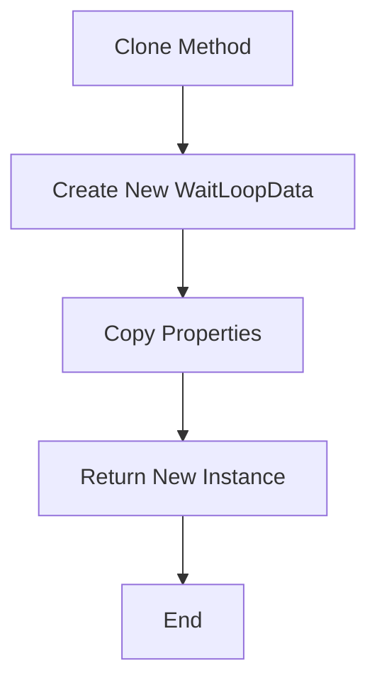
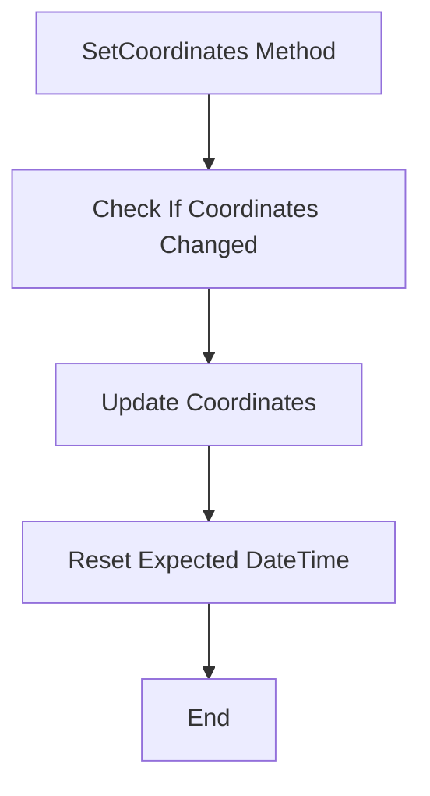
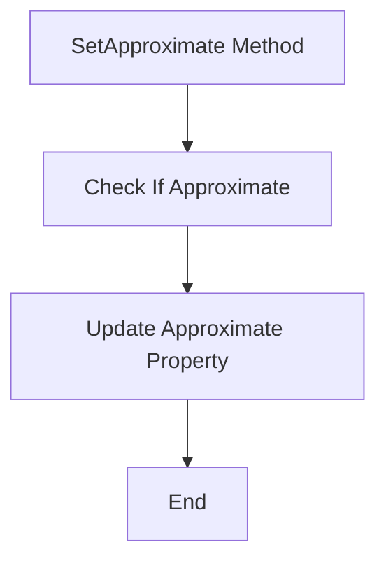
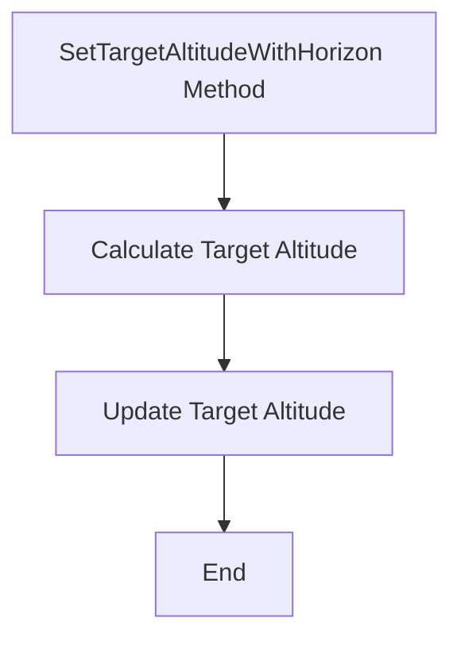
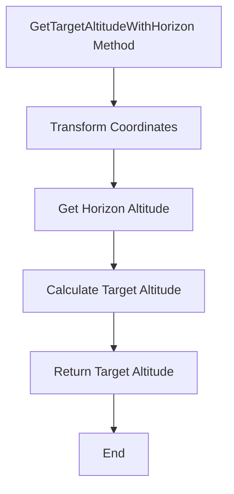

# WaitLoopData

The `WaitLoopData` class is part of the `NINA.Sequencer.SequenceItem.Utility` namespace and is used to manage and calculate waiting times based on astronomical parameters such as altitude and horizon conditions.

## Namespace

```csharp
namespace NINA.Sequencer.SequenceItem.Utility
```

## Class Declaration

```csharp
[JsonObject(MemberSerialization.OptIn)]
public class WaitLoopData : BaseINPC
```

## Properties

### `Coordinates`

- **Type:** `InputCoordinates`
- **Description:** Represents the input coordinates for the astronomical calculations.
- **Json Property:** `[JsonProperty]`

### `Offset`

- **Type:** `double`
- **Description:** The user input for the desired result. For horizons, it is `[current horizon] + offset => target horizon`. For altitudes, it is `[0] + offset => target altitude`.
- **Json Property:** `[JsonProperty]`

### `Comparator`

- **Type:** `ComparisonOperatorEnum`
- **Description:** The comparison operator used for determining if the conditions are met.
- **Json Property:** `[JsonProperty]`

### `UseCustomHorizon`

- **Type:** `bool`
- **Description:** Indicates if a custom horizon is used.

### `Name`

- **Type:** `string`
- **Description:** The name associated with this `WaitLoopData` instance.

### `Latitude`, `Longitude`, `Elevation`

- **Type:** `double`
- **Description:** The latitude, longitude, and elevation of the observer.

### `Horizon`

- **Type:** `CustomHorizon`
- **Description:** Represents the custom horizon settings.

### `Observer`

- **Type:** `ObserverInfo`
- **Description:** Information about the observer.

### `TargetAltitude`

- **Type:** `double`
- **Description:** The target altitude to reach.

### `RisingSettingDisplay`

- **Type:** `string`
- **Description:** Displays whether the object is rising or setting.

### `IsRising`

- **Type:** `bool`
- **Description:** Indicates if the object is currently rising.

### `CurrentAltitude`

- **Type:** `double`
- **Description:** The current altitude of the object.

### `Approximate`

- **Type:** `string`
- **Description:** Indicates if the altitude is approximate.

### `ExpectedDateTime`

- **Type:** `DateTime`
- **Description:** The expected date and time for reaching the target altitude.

### `ExpectedTime`

- **Type:** `string`
- **Description:** The formatted string representing the expected time.

## Constructors

### Default Constructor

```csharp
public WaitLoopData(IProfileService profileService, bool useCustomHorizon, Action calculateExpectedTime, string name)
```

- **Parameters:**
  - `profileService`: Service providing profile information.
  - `useCustomHorizon`: Indicates if a custom horizon is used.
  - `calculateExpectedTime`: Action to calculate expected time.
  - `name`: The name associated with this instance.

### Clone Constructor

```csharp
private WaitLoopData(WaitLoopData cloneMe) : this(cloneMe.profileService, cloneMe.UseCustomHorizon, cloneMe.calculateExpectedTime, cloneMe.Name)
```

- **Parameters:**
  - `cloneMe`: The instance to clone.

## Methods

### `Clone`

```csharp
public WaitLoopData Clone()
```

- **Description:** Creates a deep copy of the current `WaitLoopData` instance.
- **Flowchart:**



### `SetCoordinates`

```csharp
public void SetCoordinates(InputCoordinates coordinates)
```

- **Description:** Sets new coordinates and resets the expected time.
- **Flowchart:**



### `SetApproximate`

```csharp
public void SetApproximate(bool isApproximate)
```

- **Description:** Sets the approximate display value.
- **Flowchart:**



### `SetTargetAltitudeWithHorizon`

```csharp
public void SetTargetAltitudeWithHorizon(DateTime when)
```

- **Description:** Sets the target altitude based on the horizon for a specified date and time.
- **Flowchart:**



### `GetTargetAltitudeWithHorizon`

```csharp
public double GetTargetAltitudeWithHorizon(DateTime when)
```

- **Description:** Calculates the target altitude based on the horizon for a specified date and time.
- **Flowchart:**


