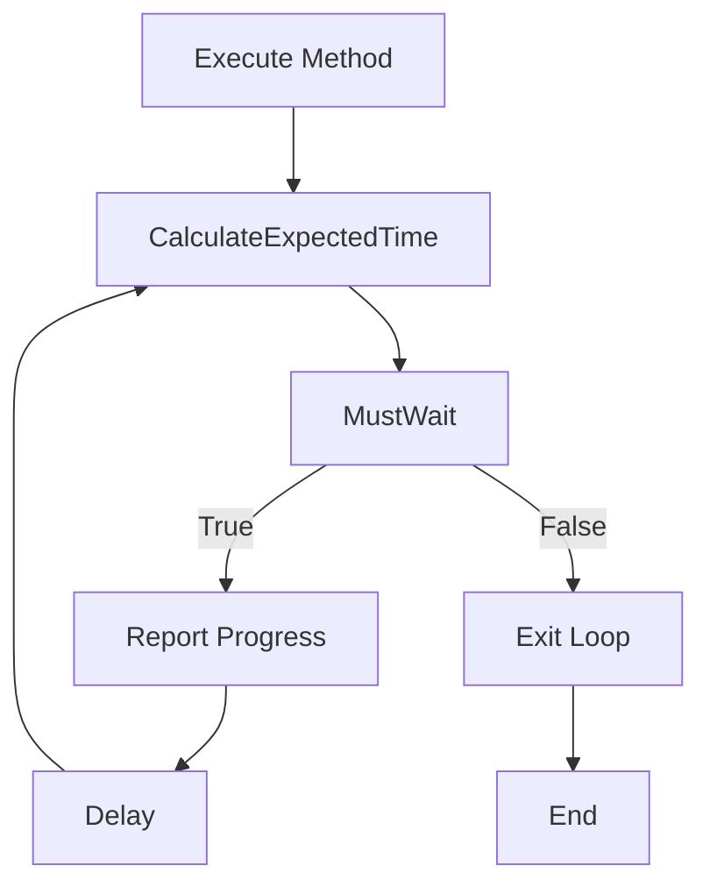
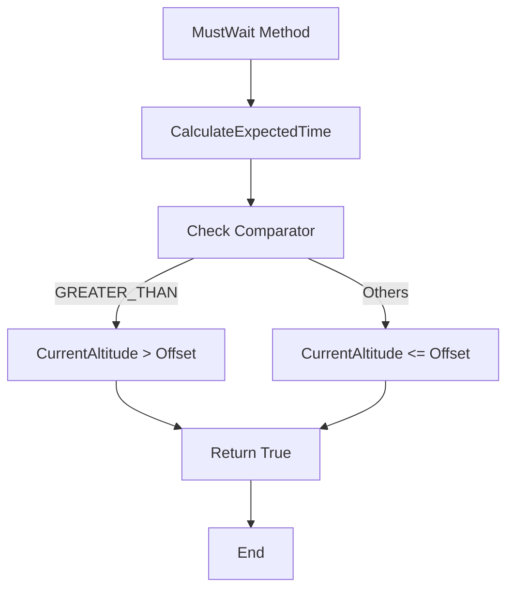
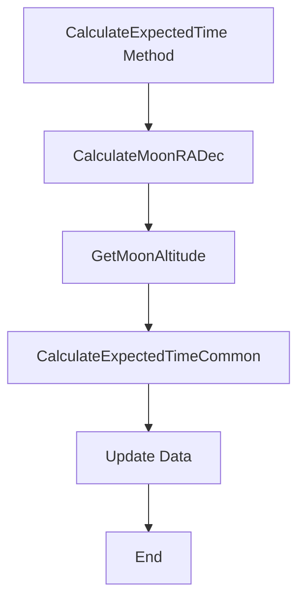

# WaitForMoonAltitude

The `WaitForMoonAltitude` class is a specific implementation of the `WaitForAltitudeBase` class used in the N.I.N.A. (Nighttime Imaging 'N' Astronomy) application. It manages waiting for the moon to reach a specified altitude based on the observer's location.

## Namespace

```csharp
namespace NINA.Sequencer.SequenceItem.Utility
```

## Class Declaration

```csharp
public class WaitForMoonAltitude : WaitForAltitudeBase, IValidatable
```

## Properties

### `ProfileService`

- **Type:** `IProfileService`
- **Description:** Provides access to profile data used for altitude calculations and waiting conditions.

### `Data`

- **Type:** `WaitLoopData`
- **Description:** Holds configuration and data related to the waiting loop, including altitude settings and comparison operators.

## Constructor

```csharp
[ImportingConstructor]
public WaitForMoonAltitude(IProfileService profileService) : base(profileService, useCustomHorizon: false)
```

- **Parameters:**
  - `profileService`: Service for accessing profile data.

Initializes the `ProfileService` and `Data` properties. Sets the initial `Data.Offset` to `0d`.

## Methods

### `Execute`

```csharp
public override async Task Execute(IProgress<ApplicationStatus> progress, CancellationToken token)
```

- **Description:** Executes the waiting process until the moon reaches the target altitude. Reports progress and handles cancellation.

- **Flowchart:**



### `MustWait`

```csharp
private bool MustWait()
```

- **Description:** Determines if the process should continue waiting based on the current altitude and comparator.

- **Flowchart:**



### `CalculateExpectedTime`

```csharp
public override void CalculateExpectedTime()
```

- **Description:** Calculates the expected time for the moon to reach the target altitude. Updates `Data` with current moon altitude and coordinates.

- **Flowchart:**



### `ToString`

```csharp
public override string ToString()
```

- **Description:** Returns a string representation of the current state, including category, item name, target altitude, comparator, and current altitude.

## Validate Method

```csharp
public bool Validate()
```

- **Description:** Validates the current state of the instance. Calls `CalculateExpectedTime` and returns true.
