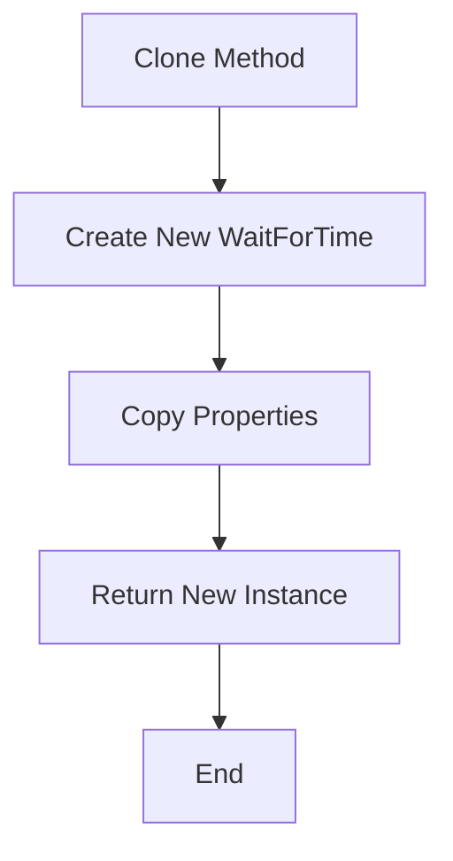
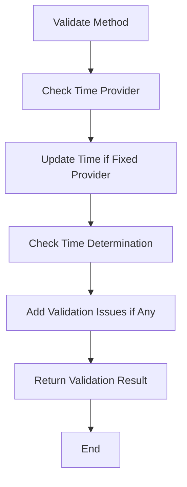
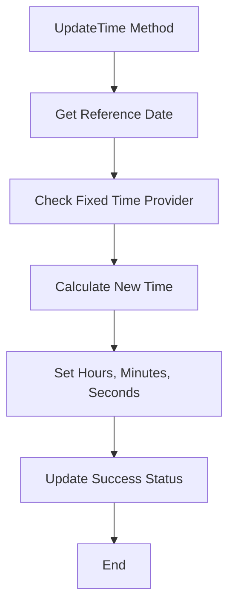
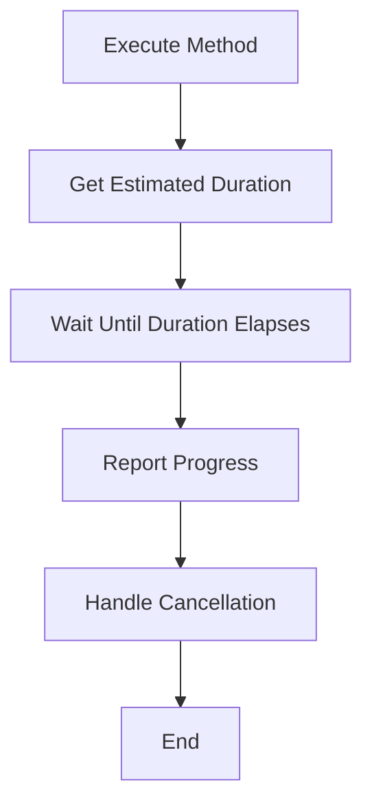
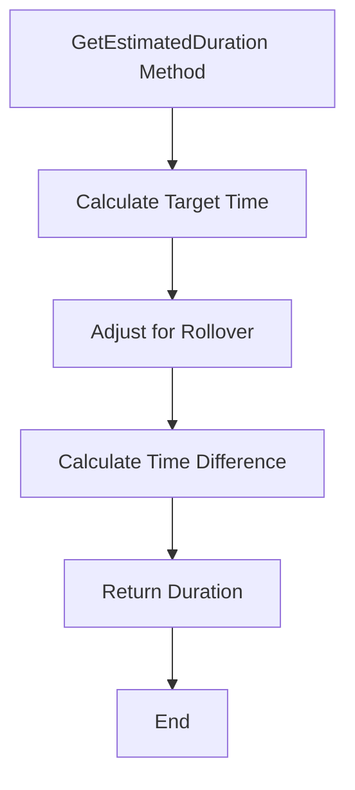

# WaitForTime

The `WaitForTime` class extends `SequenceItem` and implements the `IValidatable` interface. It is designed to wait until a specified time, considering optional time offsets and different date-time providers.

## Namespace

```csharp
namespace NINA.Sequencer.SequenceItem.Utility
```

## Class Declaration

```csharp
public class WaitForTime : SequenceItem, IValidatable
```

## Properties

### `DateTimeProviders`

- **Type:** `IList<IDateTimeProvider>`
- **Description:** List of available date-time providers.

### `SelectedProvider`

- **Type:** `IDateTimeProvider`
- **Description:** The currently selected date-time provider.

### `Hours`

- **Type:** `int`
- **Description:** The target hour for the wait time.

### `Minutes`

- **Type:** `int`
- **Description:** The target minute for the wait time.

### `MinutesOffset`

- **Type:** `int`
- **Description:** Offset in minutes to adjust the target time.

### `Seconds`

- **Type:** `int`
- **Description:** The target seconds for the wait time.

### `Issues`

- **Type:** `IList<string>`
- **Description:** List of validation issues.

## Constructor

### Default Constructor

```csharp
[ImportingConstructor]
public WaitForTime(IList<IDateTimeProvider> dateTimeProviders)
```

- **Parameters:**
  - `dateTimeProviders`: List of available date-time providers.

### Overloaded Constructor

```csharp
public WaitForTime(IList<IDateTimeProvider> dateTimeProviders, IDateTimeProvider selectedProvider)
```

- **Parameters:**
  - `dateTimeProviders`: List of available date-time providers.
  - `selectedProvider`: The selected date-time provider.

### Clone Constructor

```csharp
private WaitForTime(WaitForTime cloneMe) : this(cloneMe.DateTimeProviders, cloneMe.SelectedProvider)
```

- **Parameters:**
  - `cloneMe`: The instance to clone.

## Methods

### `Clone`

```csharp
public override object Clone()
```

- **Description:** Creates a deep copy of the current `WaitForTime` instance.

- **Flowchart:**



### `Validate`

```csharp
public bool Validate()
```

- **Description:** Validates the current state. Checks if time determination was successful and updates issues list.

- **Flowchart:**



### `UpdateTime`

```csharp
private void UpdateTime()
```

- **Description:** Updates the target time based on the selected provider and offset.

- **Flowchart:**



### `AfterParentChanged`

```csharp
public override void AfterParentChanged()
```

- **Description:** Updates the time when the parent changes.

### `Execute`

```csharp
public override Task Execute(IProgress<ApplicationStatus> progress, CancellationToken token)
```

- **Description:** Executes the waiting task until the specified time is reached.

- **Flowchart:**



### `GetEstimatedDuration`

```csharp
public override TimeSpan GetEstimatedDuration()
```

- **Description:** Calculates the duration until the target time is reached, considering rollovers.

- **Flowchart:**



### `ToString`

```csharp
public override string ToString()
```

- **Description:** Returns a string representation of the current state, including target time and offset.
