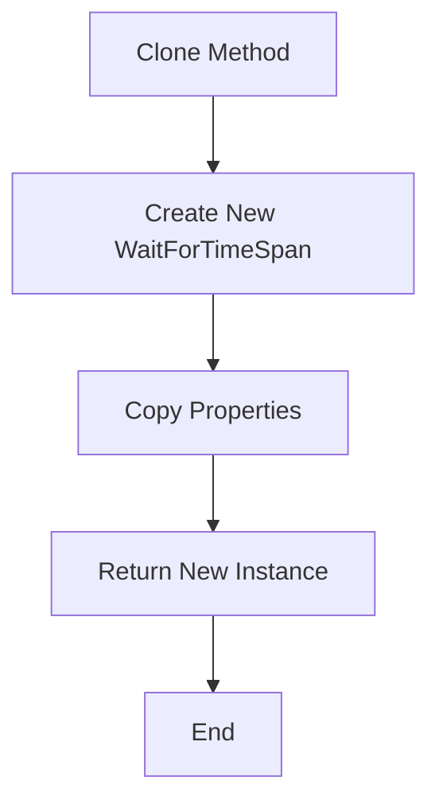
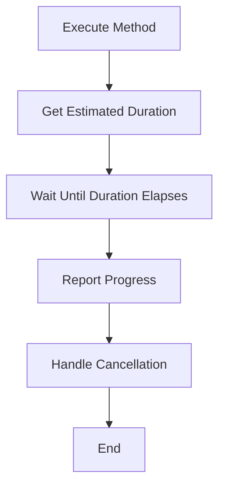
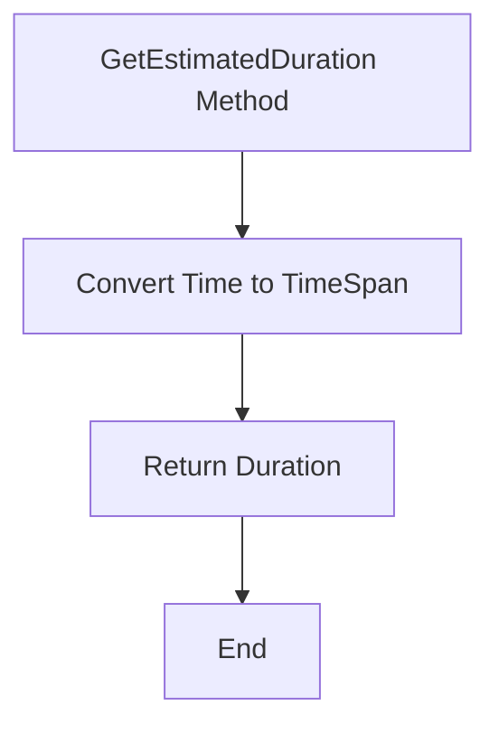
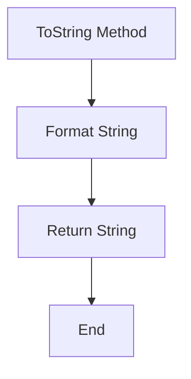

# WaitForTimeSpan

The `WaitForTimeSpan` class extends `SequenceItem` and is designed to wait for a specified time span. It provides a simple way to introduce delays in a sequence based on a duration defined in seconds.

## Namespace

```csharp
namespace NINA.Sequencer.SequenceItem.Utility
```

## Class Declaration

```csharp
public class WaitForTimeSpan : SequenceItem
```

## Properties

### `Time`

- **Type:** `double`
- **Description:** The duration to wait, in seconds.
- **Json Property:** `[JsonProperty]`

## Constructor

### Default Constructor

```csharp
[ImportingConstructor]
public WaitForTimeSpan()
```

- **Description:** Initializes a new instance with a default time of 1 second.

### Clone Constructor

```csharp
private WaitForTimeSpan(WaitForTimeSpan cloneMe) : base(cloneMe)
```

- **Parameters:**
  - `cloneMe`: The instance to clone.

## Methods

### `Clone`

```csharp
public override object Clone()
```

- **Description:** Creates a deep copy of the current `WaitForTimeSpan` instance.
- **Flowchart:**



### `Execute`

```csharp
public override Task Execute(IProgress<ApplicationStatus> progress, CancellationToken token)
```

- **Description:** Executes the waiting task for the duration specified by `Time`.
- **Flowchart:**



### `GetEstimatedDuration`

```csharp
public override TimeSpan GetEstimatedDuration()
```

- **Description:** Returns the estimated duration to wait as a `TimeSpan`, based on the `Time` property.
- **Flowchart:**



### `ToString`

```csharp
public override string ToString()
```

- **Description:** Returns a string representation of the current state, including the time span to wait.
- **Flowchart:**


